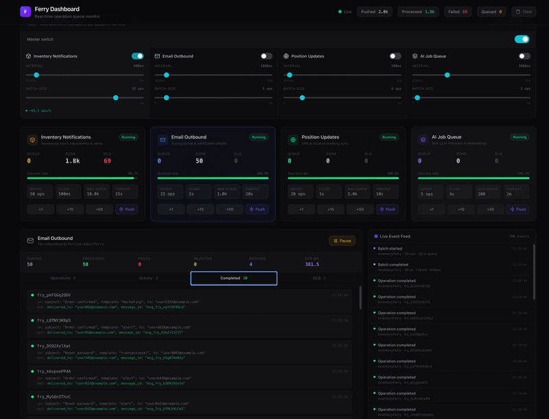

# Ferry

[](https://hex.pm/packages/ferry)
[](https://hexdocs.pm/ferry)

In-memory operation queue for Elixir — batch your cargo, ship it on schedule, and never lose a package.

## Overview

Ferry buffers operations in-memory and processes them in configurable batches through a user-defined resolver function. When things go wrong — timeouts, crashes, partial failures — operations land in a dead-letter queue where you can inspect, retry, or discard them. Every state transition emits telemetry events, giving you full visibility into what's happening inside the queue.

Each Ferry instance runs its own supervision subtree and can be configured independently: batch size, flush interval, back-pressure limits, storage backend, and more. You can run dozens of Ferry instances in a single application, each with its own resolver and config.

- **Batched processing** — configurable batch sizes with automatic or manual flushing
- **Dead Letter Queue** — failed operations captured with full error context for inspection, retry, or discard
- **Back-pressure** — `push` returns `{:error, :queue_full}` when `max_queue_size` is reached
- **Telemetry** — 15 events covering every lifecycle point for logging, metrics, and alerting
- **ETS persistence** — optional ETS backend survives process crashes via the heir pattern
- **Batch history tracking** — opt-in historical record of every batch executed
- **Stats** — real-time counters for throughput, failures, uptime, and average batch duration
- **Zero runtime dependencies** beyond `:telemetry`

## Installation

Add `ferry` to your list of dependencies in `mix.exs`:

```elixir
def deps do
  [
    {:ferry, "~> 0.1.0"}
  ]
end
```

Requires Elixir 1.17+. The only runtime dependency is [`:telemetry`](https://hex.pm/packages/telemetry).

## Quick Start

### 1. Define your resolver

The resolver receives a `%Ferry.Batch{}` and must return a result for every operation:

```elixir
defmodule MyApp.ApiResolver do
  def resolve(%Ferry.Batch{operations: ops}) do
    Enum.map(ops, fn op ->
      case HttpClient.post(op.payload.url, op.payload.body) do
        {:ok, resp} -> {op.id, :ok, resp}
        {:error, err} -> {op.id, :error, err}
      end
    end)
  end
end
```

### 2. Define your Ferry

```elixir
defmodule MyApp.ApiFerry do
  use Ferry,
    resolver: &MyApp.ApiResolver.resolve/1,
    batch_size: 25,
    flush_interval: :timer.seconds(5),
    max_queue_size: 5_000
end
```

### 3. Add to your supervision tree

```elixir
# application.ex
children = [
  MyApp.ApiFerry
]

Supervisor.start_link(children, strategy: :one_for_one)
```

### 4. Push and track operations

```elixir
# Push a single operation
{:ok, id} = Ferry.push(MyApp.ApiFerry, %{url: "/users", body: data})

# Check its status after a flush
{:ok, %Ferry.Operation{status: :completed, result: response}} =
  Ferry.status(MyApp.ApiFerry, id)

# Get instance stats
stats = Ferry.stats(MyApp.ApiFerry)
# => %Ferry.Stats{total_pushed: 1, total_processed: 1, queue_size: 0, ...}
```

## Architecture

Each Ferry instance starts its own supervision subtree using the `:rest_for_one` strategy:

```
YourApp.Supervisor
└── MyApp.ApiFerry (Ferry.InstanceSupervisor, :rest_for_one)
    ├── Ferry.EtsHeir          # only if persistence: :ets
    ├── Ferry.Server           # GenServer — queue, flush, resolver dispatch
    ├── Ferry.StatsCollector   # telemetry listener for stats accumulation
    └── Ferry.BatchTracker     # only if batch_tracking: true
```

**Ferry.Server** is the core GenServer. It owns the store (memory or ETS), manages the auto-flush timer, spawns monitored tasks for resolver execution, and processes results.

**Ferry.EtsHeir** (optional) holds ETS tables when the Server crashes. When the Server restarts, it reclaims its tables from the heir — no data is lost.

**Ferry.StatsCollector** attaches telemetry handlers scoped to this instance and accumulates counters for `Ferry.stats/1`.

**Ferry.BatchTracker** (optional) listens to batch telemetry events and maintains a bounded history of `%Ferry.BatchRecord{}` structs for post-hoc analysis.

The `:rest_for_one` strategy ensures that if the Server crashes, downstream processes (StatsCollector, BatchTracker) restart too, while the EtsHeir stays alive to hold the tables.

## Operation Lifecycle

```
                    push/2
                      │
                      ▼
                 ┌──────────┐
                 │ :pending  │◄──────── retry_dead_letters/1
                 └────┬──────┘                  ▲
                      │                         │
                  flush (timer              ┌───┴───┐
                  or manual)                │ :dead  │
                      │                     └───▲────┘
                      ▼                         │
               ┌─────────────┐                  │
               │ :processing  │                 │
               └──┬────────┬──┘                 │
                  │        │                    │
       resolver   │        │  resolver error    │
       success    │        │  timeout / crash   │
                  │        │                    │
                  ▼        └────────────────────┘
           ┌────────────┐
           │ :completed  │
           └────────────┘
```

| Transition | Trigger |
|---|---|
| `:pending` → `:processing` | Flush pops a batch from the queue |
| `:processing` → `:completed` | Resolver returned `{id, :ok, result}` |
| `:processing` → `:dead` | Resolver returned `{id, :error, reason}`, timed out, crashed, or returned a bad value |
| `:pending` → `:dead` | `clear/1` moves all pending to DLQ with error `:canceled` |
| `:dead` → `:pending` | `retry_dead_letters/1` re-enqueues all DLQ operations |

Completed operations are kept in a bounded history (configurable via `max_completed` and `completed_ttl`) and automatically purged.

## Configuration

### Required

| Option | Description |
|---|---|
| `name` | Atom identifier for the Ferry instance |
| `resolver` | Function that processes a `%Ferry.Batch{}` and returns results |

### Batching & Timing

| Option | Default | Description |
|---|---|---|
| `batch_size` | `10` | Max operations per batch flush |
| `flush_interval` | `5_000` | Milliseconds between auto-flushes |
| `auto_flush` | `true` | Whether timer-based flushing is active on start |
| `operation_timeout` | `300_000` | Max ms for resolver execution per flush |

### Capacity

| Option | Default | Description |
|---|---|---|
| `max_queue_size` | `10_000` | Max pending ops — push returns `{:error, :queue_full}` beyond this |

### History & Retention

| Option | Default | Description |
|---|---|---|
| `max_completed` | `1_000` | Max completed operations to keep in memory |
| `completed_ttl` | `1_800_000` (30 min) | TTL for completed operations (ms) |

> **High-throughput note:** At sustained volumes, the default `max_completed` of 1,000 may fill quickly. Consider raising it or lowering `completed_ttl` to match your throughput. If you don't need the completed history and rely on telemetry instead, set `max_completed` to a low value to keep memory usage minimal.

### Batch Tracking (opt-in)

| Option | Default | Description |
|---|---|---|
| `batch_tracking` | `false` | Enable batch history tracking |
| `max_batch_history` | `1_000` | Max batch records to retain |
| `batch_history_ttl` | `3_600_000` (1 hr) | TTL for batch records (ms); set `:infinity` to disable |

### Storage & Identity

| Option | Default | Description |
|---|---|---|
| `persistence` | `:memory` | `:memory` or `:ets` |
| `id_generator` | `&Ferry.IdGenerator.generate/1` | Custom ID generator function; receives the payload |

## Resolver Contract

The resolver function must:

1. Accept a `%Ferry.Batch{}` struct
2. Return a list of `{operation_id, :ok | :error, result_or_reason}` tuples
3. Return a result for **every** operation in the batch

```elixir
@type resolver_result ::
  {operation_id :: String.t(), :ok, result :: term()} |
  {operation_id :: String.t(), :error, reason :: term()}

@type resolver :: (Ferry.Batch.t() -> [resolver_result()])
```

The `%Ferry.Batch{}` struct contains:

| Field | Type | Description |
|---|---|---|
| `id` | `String.t()` | Unique batch ID |
| `operations` | `[Ferry.Operation.t()]` | Operations in this batch |
| `size` | `non_neg_integer()` | Number of operations |
| `ferry_name` | `atom()` | Instance name |
| `flushed_at` | `DateTime.t()` | When the batch was created |
| `metadata` | `map()` | Optional metadata |

### What happens on failure

| Scenario | Effect |
|---|---|
| Resolver returns `{id, :error, reason}` | That operation moves to DLQ with the error |
| Resolver omits an operation ID | That operation moves to DLQ with `:no_result_returned` |
| Resolver raises or crashes | Entire batch moves to DLQ with `{:exit, reason}` |
| Resolver exceeds `operation_timeout` | Entire batch moves to DLQ with `:timeout` |
| Resolver returns a non-list | Entire batch moves to DLQ with `:bad_return` |

## API Reference

### Push

```elixir
Ferry.push(name, payload)
# {:ok, id} | {:error, :queue_full}

Ferry.push_many(name, [payload1, payload2, ...])
# {:ok, [id1, id2, ...]} | {:error, :queue_full}
# All-or-nothing: if the queue can't fit all, none are pushed
```

### Query

```elixir
Ferry.status(name, id)
# {:ok, %Ferry.Operation{}} | {:error, :not_found}

Ferry.status_many(name, [id1, id2])
# %{id1 => {:ok, %Operation{}}, id2 => {:error, :not_found}}

Ferry.stats(name)
# %Ferry.Stats{}

Ferry.queue_size(name)
# non_neg_integer()

Ferry.config(name)
# %{batch_size: 10, flush_interval: 5000, max_queue_size: 10000, ...}
```

### Introspection

```elixir
Ferry.pending(name, limit: 50)
# [%Ferry.Operation{}]

Ferry.completed(name, limit: 50)
# [%Ferry.Operation{}]
```

### Flow Control

```elixir
Ferry.flush(name)
# :ok | {:error, :empty_queue}
# Synchronous — blocks until the batch is processed

Ferry.pause(name)
# :ok — stops auto-flush timer; manual flush still works

Ferry.resume(name)
# :ok — restarts auto-flush timer
```

### Dead Letter Queue

```elixir
Ferry.dead_letters(name)
# [%Ferry.Operation{}]

Ferry.dead_letter_count(name)
# non_neg_integer()

Ferry.retry_dead_letters(name)
# {:ok, count} — moves all back to pending queue

Ferry.drain_dead_letters(name)
# :ok — permanently discards all dead letters
```

### Queue Management

```elixir
Ferry.clear(name)
# {:ok, count} — moves all pending to DLQ with error :canceled
```

### Batch History

Requires `batch_tracking: true` in instance config.

```elixir
Ferry.batch_history(name, limit: 10, status: :completed)
# [%Ferry.BatchRecord{}] | {:error, :not_enabled}

Ferry.batch_info(name, batch_id)
# {:ok, %Ferry.BatchRecord{}} | {:error, :not_found} | {:error, :not_enabled}

Ferry.purge_batch_history(name)
# :ok | {:error, :not_enabled}
```

## Data Structures

### `%Ferry.Operation{}`

```elixir
%Ferry.Operation{
  id:           String.t(),           # e.g. "fry_KJ82mXa9pQ"
  payload:      term(),               # the data you pushed
  order:        pos_integer(),        # FIFO insertion order
  status:       :pending | :processing | :completed | :dead,
  pushed_at:    DateTime.t(),         # when the operation was pushed
  completed_at: DateTime.t() | nil,   # when processing finished
  result:       term() | nil,         # resolver success value
  error:        term() | nil,         # resolver error reason
  batch_id:     String.t() | nil      # which batch processed this
}
```

### `%Ferry.Stats{}`

```elixir
%Ferry.Stats{
  queue_size:            non_neg_integer(),  # current pending operations
  dlq_size:              non_neg_integer(),  # current dead-lettered operations
  completed_size:        non_neg_integer(),  # current completed in history
  total_pushed:          non_neg_integer(),  # lifetime total pushed
  total_processed:       non_neg_integer(),  # lifetime total successfully processed
  total_failed:          non_neg_integer(),  # lifetime total failed
  total_rejected:        non_neg_integer(),  # lifetime total rejected (queue_full)
  batches_executed:      non_neg_integer(),  # lifetime total batches flushed
  avg_batch_duration_ms: float(),            # average batch duration
  last_flush_at:         DateTime.t() | nil, # last flush completion time
  uptime_ms:             non_neg_integer(),  # ms since instance start
  status:                :running | :paused  # current instance status
}
```

### `%Ferry.BatchRecord{}`

Requires `batch_tracking: true`.

```elixir
%Ferry.BatchRecord{
  id:            String.t(),                  # unique batch ID
  operation_ids: [String.t()],                # IDs of operations in this batch
  size:          non_neg_integer(),           # number of operations
  trigger:       :timer | :manual | atom(),   # what triggered the flush
  status:        :started | :completed | :timeout | :crashed,
  started_at:    DateTime.t(),                # when the batch started
  completed_at:  DateTime.t() | nil,          # when it finished
  duration_ms:   non_neg_integer() | nil,     # total duration
  succeeded:     non_neg_integer(),           # count of successful operations
  failed:        non_neg_integer()            # count of failed operations
}
```

## Batch Tracking

Batch tracking is an opt-in feature that records the history of every batch executed by a Ferry instance.

```elixir
defmodule MyApp.TrackedFerry do
  use Ferry,
    resolver: &MyApp.Resolver.resolve/1,
    batch_tracking: true,
    max_batch_history: 500,
    batch_history_ttl: :timer.hours(2)
end
```

When enabled, a `Ferry.BatchTracker` GenServer starts alongside the Ferry instance and listens to batch telemetry events. It creates a `%Ferry.BatchRecord{}` on every flush and updates it when the batch completes, times out, or crashes.

```elixir
# List recent completed batches
records = Ferry.batch_history(MyApp.TrackedFerry, limit: 10, status: :completed)

# Get details for a specific batch
{:ok, record} = Ferry.batch_info(MyApp.TrackedFerry, "fry_abc123")
record.duration_ms  # => 342
record.succeeded    # => 24
record.failed       # => 1
```

History is automatically bounded by `max_batch_history` (count) and `batch_history_ttl` (time). Expired records are purged every 30 seconds. You can also purge manually with `Ferry.purge_batch_history/1`.

## Persistence

### `:memory` (default)

All state lives in the GenServer process via Erlang's `:queue` and maps. Zero overhead, fastest option. State is lost if the process crashes — the supervisor restarts the instance with empty queues.

### `:ets`

Queue, DLQ, completed history, and index are stored across 4 named ETS tables per instance. Tables use the **heir pattern** for crash recovery:

1. `Ferry.EtsHeir` starts **before** `Ferry.Server` in the supervision tree
2. All 4 ETS tables are created with the heir set to the EtsHeir process
3. If the Server crashes, ETS automatically transfers table ownership to the heir
4. When the Server restarts, it calls `EtsHeir.register_server/2` and the heir gives the tables back
5. The Server resumes with full queue state intact — only in-flight batches are lost

```elixir
defmodule MyApp.DurableFerry do
  use Ferry,
    resolver: &MyApp.Resolver.resolve/1,
    persistence: :ets
end
```

Table naming convention: `ferry_<name>_<type>` where type is `queue`, `dlq`, `completed`, or `index`.

## Telemetry Events

All events are prefixed with `[:ferry]`. The ferry instance name is always in metadata as `:ferry`.

### Operation Events

| Event | Measurements | Metadata |
|---|---|---|
| `[:ferry, :operation, :pushed]` | `queue_size` | `ferry`, `operation_id` |
| `[:ferry, :operation, :completed]` | `duration_ms` | `ferry`, `operation_id`, `batch_id` |
| `[:ferry, :operation, :failed]` | `duration_ms` | `ferry`, `operation_id`, `error`, `batch_id` |
| `[:ferry, :operation, :dead_lettered]` | — | `ferry`, `operation_id`, `error` |
| `[:ferry, :operation, :rejected]` | `queue_size` | `ferry`, `reason` |

### Batch Events

| Event | Measurements | Metadata |
|---|---|---|
| `[:ferry, :batch, :started]` | `batch_size`, `queue_size_before` | `ferry`, `batch_id`, `trigger`, `operation_ids` |
| `[:ferry, :batch, :completed]` | `batch_size`, `succeeded`, `failed`, `duration_ms` | `ferry`, `batch_id` |
| `[:ferry, :batch, :timeout]` | `batch_size`, `timeout_ms` | `ferry`, `batch_id` |
| `[:ferry, :batch, :crashed]` | `batch_size` | `ferry`, `batch_id`, `reason` |

### Queue Events

| Event | Measurements | Metadata |
|---|---|---|
| `[:ferry, :queue, :paused]` | — | `ferry` |
| `[:ferry, :queue, :resumed]` | — | `ferry` |
| `[:ferry, :queue, :cleared]` | `count` | `ferry` |

### DLQ Events

| Event | Measurements | Metadata |
|---|---|---|
| `[:ferry, :dlq, :retried]` | `count` | `ferry` |
| `[:ferry, :dlq, :drained]` | `count` | `ferry` |

### Maintenance Events

| Event | Measurements | Metadata |
|---|---|---|
| `[:ferry, :completed, :purged]` | `count` | `ferry`, `reason` |

### Attaching a handler

```elixir
:telemetry.attach(
  "ferry-logger",
  [:ferry, :batch, :completed],
  fn _event, measurements, metadata, _config ->
    Logger.info(
      "[#{metadata.ferry}] Batch #{metadata.batch_id}: " <>
      "#{measurements.succeeded} ok, #{measurements.failed} failed " <>
      "in #{measurements.duration_ms}ms"
    )
  end,
  nil
)
```

## Examples

### Email Delivery

```elixir
defmodule MyApp.EmailResolver do
  def resolve(%Ferry.Batch{operations: ops}) do
    Enum.map(ops, fn op ->
      case Mailer.deliver(op.payload.to, op.payload.subject, op.payload.body) do
        :ok -> {op.id, :ok, :delivered}
        {:error, reason} -> {op.id, :error, reason}
      end
    end)
  end
end

defmodule MyApp.EmailFerry do
  use Ferry,
    resolver: &MyApp.EmailResolver.resolve/1,
    batch_size: 50,
    flush_interval: :timer.seconds(10),
    max_queue_size: 10_000
end

# Push an email
{:ok, id} = Ferry.push(MyApp.EmailFerry, %{
  to: "user@example.com",
  subject: "Welcome!",
  body: "Thanks for signing up."
})
```

### Third-Party API with Rate Limiting

```elixir
defmodule MyApp.SlackFerry do
  use Ferry,
    resolver: &MyApp.SlackResolver.resolve/1,
    batch_size: 5,            # small batches to stay under rate limits
    flush_interval: 2_000,    # space out API calls
    operation_timeout: 15_000
end
```

### Webhook Fan-Out

```elixir
# Push multiple webhooks atomically
{:ok, ids} = Ferry.push_many(MyApp.WebhookFerry, [
  %{url: "https://a.example.com/hook", event: "order.created", data: order},
  %{url: "https://b.example.com/hook", event: "order.created", data: order}
])

# Check delivery status
results = Ferry.status_many(MyApp.WebhookFerry, ids)
# %{"fry_abc" => {:ok, %Operation{status: :completed}},
#   "fry_def" => {:ok, %Operation{status: :dead, error: :timeout}}}
```

## Dashboard

A Phoenix LiveView dashboard is included in `examples/ferry_dashboard/`. It lets you monitor operations across all your Ferry instances in real time — see pending, completed, and dead-lettered operations, control push/flush cycles, manage the DLQ, and follow a live event stream.

<p align="center">
  
</p>

```bash
cd examples/ferry_dashboard
mix setup
mix phx.server
```

## Custom ID Generators

By default, Ferry generates `fry_`-prefixed IDs using 10 random base62 characters (e.g., `fry_KJ82mXa9pQ`). You can override this with the `id_generator` option:

```elixir
defmodule MyApp.IdempotentFerry do
  use Ferry,
    resolver: &MyApp.Resolver.resolve/1,
    id_generator: fn payload -> "order_#{payload.order_id}" end
end
```

The function receives the operation payload as its argument.

## Multiple Instances

You can run as many Ferry instances as you need. Each has its own supervision subtree, store, timers, and telemetry scope:

```elixir
children = [
  MyApp.ApiFerry,
  MyApp.EmailFerry,
  MyApp.WebhookFerry,
  MyApp.AiJobsFerry
]

Supervisor.start_link(children, strategy: :one_for_one)
```

Instances are fully isolated — separate ETS tables (if using `:ets`), separate auto-flush timers, and telemetry events scoped by the `:ferry` metadata field.

## Testing

For deterministic tests, disable auto-flush and trigger flushes manually:

```elixir
defp start_ferry(opts \\ []) do
  name = :"ferry_#{System.unique_integer([:positive])}"

  defaults = [
    name: name,
    resolver: fn %Ferry.Batch{operations: ops} ->
      Enum.map(ops, fn op -> {op.id, :ok, {:processed, op.payload}} end)
    end,
    auto_flush: false,
    batch_size: 10
  ]

  start_supervised!({Ferry, Keyword.merge(defaults, opts)})
  name
end

test "operations are processed in order" do
  name = start_ferry()

  {:ok, id1} = Ferry.push(name, :first)
  {:ok, id2} = Ferry.push(name, :second)
  :ok = Ferry.flush(name)

  {:ok, %{status: :completed, result: {:processed, :first}}} = Ferry.status(name, id1)
  {:ok, %{status: :completed, result: {:processed, :second}}} = Ferry.status(name, id2)
end
```

## License

MIT
